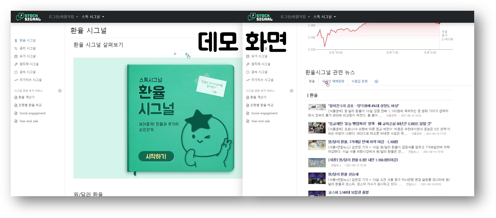

# 친절한 거시경제지표 서비스 - 하나 스톡시그널

[프로젝트 홈페이지 - https://koposoftware.github.io/2021_19_jhhwang/](https://koposoftware.github.io/2021_19_jhhwang/)

# 1. 프로젝트 개요

 주식투자 특히 장기투자에 가장 중요한 정보인 거시경제지표를 제공하는 웹 서비스입니다. 기존의 거시경제지표 서비스는 숫자와 그래프의 나열로 이루어져 있고, 입문자에게 진입장벽이 높은 정보입니다. 이에 전문가의 친절한 해석을 통해 이 지표들이 주가에 미치는 영향을 살펴보고, 사용자 간의 정보 공유를 하여 장기투자에 필요한 정보를 얻을 수 있습니다. 그리고 시장의 위기와 기회를 전문가가 판단하여 알림 서비스를 제공합니다.

# 2. 프로젝트 제안서

초기 하나 스톡시그널의 주제 선정 및 제안 발표 자료입니다.

   [발표자료](/스톡시그널_제안발표.pptx) 
   
   <iframe width="640" height="360" src="https://www.youtube.com/embed/sggIi6EwXP8" title="YouTube video player" frameborder="0" allow="accelerometer; autoplay; clipboard-write; encrypted-media; gyroscope; picture-in-picture" allowfullscreen></iframe>

# 3. 프로젝트 결과
프로젝트 결과를 추가하세요. 발표자료. 시연동영상을 추가하세요.

## 발표 ppt 
   [발표자료](/project.pptx) 

## 시연 동영상 

   <iframe id="ytplayer" type="text/html" width="640" height="360" src="https://www.youtube.com/embed/6LxbdIjWP04" frameborder="0"></iframe>
   

# 4. 본인 소개

본인 소개를 추가하세요

|이름 |고길동||
|연락처 | gdko(@)kopo.ac.kr|
|skill set| Frontend - HTML, CSS, Javascript|
| | Backend - Java, Spring, Oracle|
|자격증|  |
|수상| |
|특기사항|  TOEIC 990 |

# 5. 기타
그외 프로젝트를 더욱 설명할수 있는 것들을 추가하세요

# 홈페이지 설정
 본인 repository에서 "Setting"를 들어가서 GitHub Pages에서 설정 변경.
* Source
 Source에서 원하는 branch와 directory 설정한다. 
 기본값은 master 에 root를 설정 
 Save 버튼 꼭 누른다.
 
 * Theme Chooser
 theme을 변경하여 좀더 이쁜 홈페이지를 만든다.
   
    
   
 
