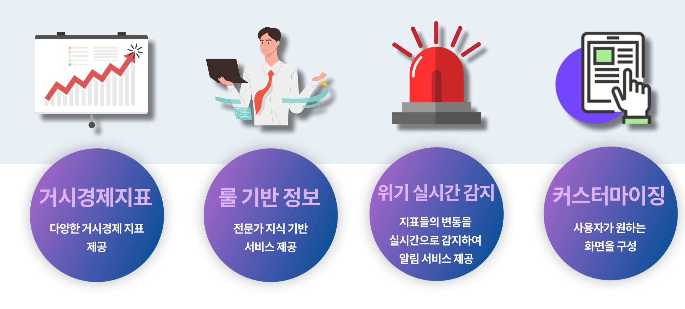
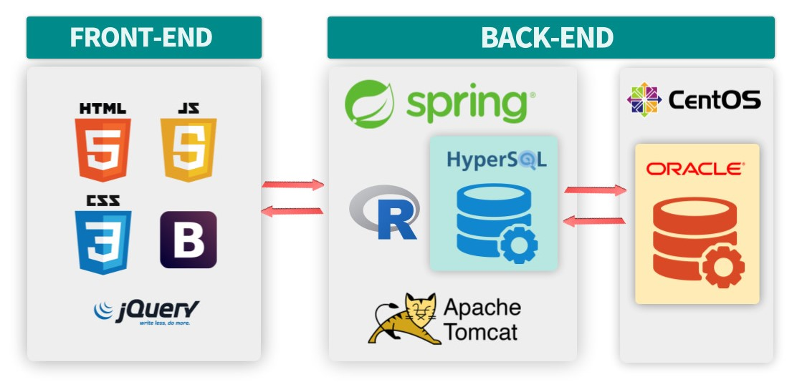
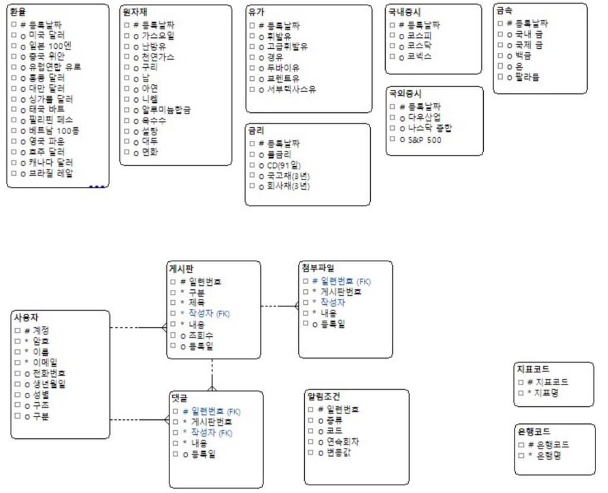
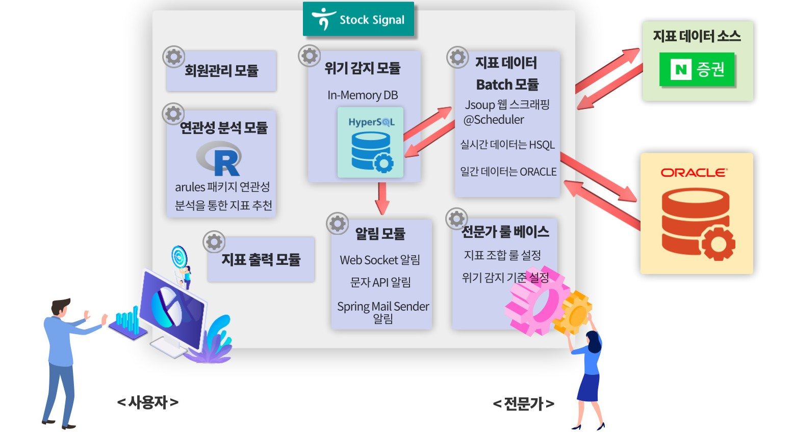

# 친절한 거시경제지표 서비스 - 하나 스톡시그널

[프로젝트 홈페이지 - https://koposoftware.github.io/2021_19_jhhwang/](https://koposoftware.github.io/2021_19_jhhwang/)

# 1. 프로젝트 개요

&nbsp;&nbsp;주식투자 특히 장기투자에 가장 중요한 정보인 거시경제지표를 제공하는 웹 서비스입니다. 기존의 거시경제지표 서비스는 숫자와 그래프의 나열로 이루어져 있고, 입문자에게 진입장벽이 높은 정보입니다. 이에 전문가의 친절한 해석을 통해 이 지표들이 주가에 미치는 영향을 살펴보고, 사용자 간의 정보 공유를 하여 장기투자에 필요한 정보를 얻을 수 있습니다. 그리고 시장의 위기와 기회를 전문가가 판단하여 알림 서비스를 제공합니다.

# 2. 프로젝트 제안서

초기 하나 스톡시그널의 주제 선정 및 제안 발표 자료입니다.
   
    
   [제안발표자료](/스톡시그널_제안발표.pptx)  
   초기 목업 화면입니다. 
     
   주제 제안발표 영상입니다. 
   

# 3. 프로젝트 결과
최종 프로젝트 결과입니다.

## * 발표 ppt 
    
   [최종발표자료](/스톡시그널_최종발표.pptx) 

## * 시연 동영상 

   

# 4. 프로젝트 결과 요약

## * 수행기간
   2021-09-06 ~ 2021-10-05

## * 담당업무
   하나 스톡시그널 프로젝트 설계 및 제작, Front-End/Back-End 개발

## * 주요기능
   

## * 사용기술
- Spring-MVC 패턴
- In-Memory Database(HyperSQL)을 사용하여 실시간 데이터 적재
- Rule-based expert system
- R과 Spring 연동(arules 패키지를 통한 연관성 분석)
- Web-Socket을 활용한 알림기능
- Spring MailSender, CoolSMS API를 사용한 이메일, 문자 알림
- Spring Scheduler와 Spring Jsoup을 활용한 지표데이터 Batch처리
- jQuery-UI를 활용하여 사용자 정의 커스텀 페이지 기능 구현

## * 개발환경
- OS : Window10, Linux CentOS7
- Framework : Spring Framework 4, Mybatis
- Server : Apache Tomcat9
- Language : Java(jdk-1.8), Javascript, HTML, CSS, R
- IDE Tools : Eclipse, Sqldeveloper, R-studio
- DB : Oracle 11g, HyperSQL 2.5.0
- Library : jQuery, iQuery-UI, JSTL, Bootstrap-4.3.1

## * 시스템 아키텍쳐
   
   
## * ERD
   

## * 서비스 구성도
   

## * 보완점
1. 다양한 지표 추가하기
더 많은 지표와 데이터를 포함하여 지표 선택의 범위와 탐색의 범위를 넓힙니다.

2. 전문가 룰의 현재 및 과거 평가
전문가가 추천한 지표 조합이 현재 어떤 신호를 보이는지 평가합니다. 또한, 과거 데이터를 통해 얼마나 높은 예측력을 갖는지 평가합니다.

3. 룰 수정의 자유도
알림의 전문가 룰이 더욱 자유도 있게 수정, 적용되도록 합니다.

4. 뉴스 크롤링 부하개선
여러 사용자가 동시 접근 시 과도한 부하를 개선하기 위해 네이버 뉴스 API를 사용하여 이를 구현합니다. 

# 5. 본인 소개

|항목|내용||
|-----|---------------------------|----|
|이름 |황준호||
|연락처 | luffy333(@)naver.com|
|skill set| Frontend - HTML, CSS, Javascript|
| | Backend - Java, Spring, Oracle, HSQL|
| | Etc - R, Git|
|경력사항| 한국정보화진흥원 공공데이터 품질개선 업무 인턴 |
|특기사항| 배운 내용 다른 사람에게 설명하고 공유하기 |
